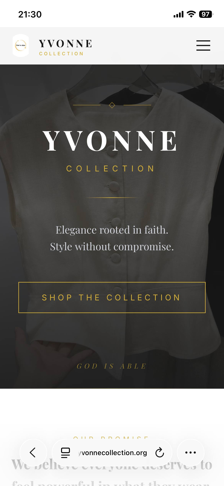
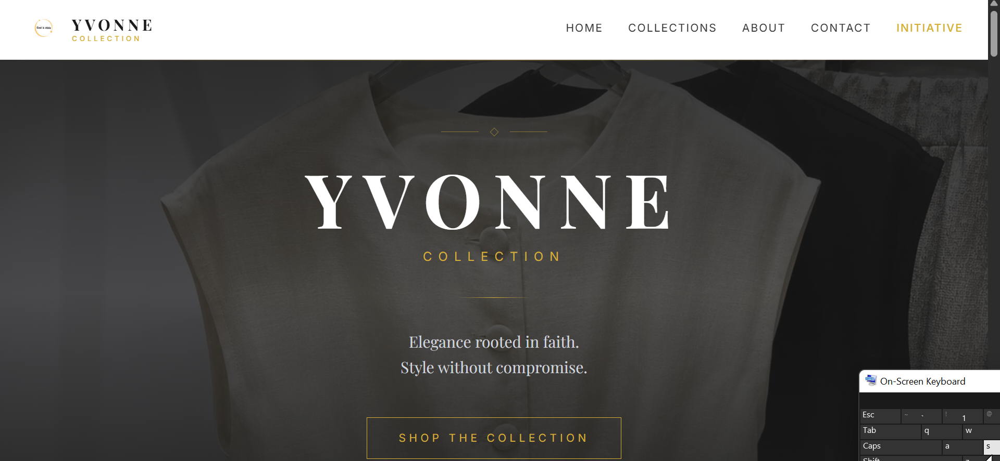
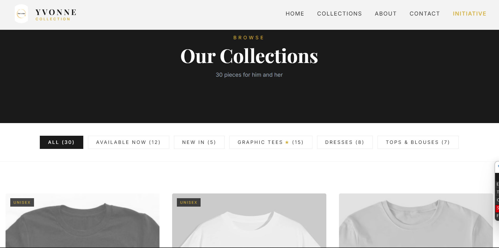
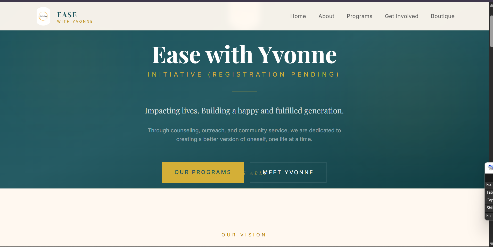

# Yvonne Collection

Live: **https://yvonnecollection.org**

A dual-purpose Next.js website for **Yvonne Collection**, a CAC-registered boutique in Asaba, Nigeria, and **Ease with Yvonne Initiative**, its community outreach arm. The store runs on a manual WhatsApp ordering flow (no cart, no online payments), and the Initiative pages present counseling support, widows outreach, school outreach, orphanage visitation, and sanctuary visits.

Built by Emmanuel to run his mother's business online and to serve as professional web development portfolio work.

## Screenshots

Live on the custom domain, desktop and mobile:






## Features

**Boutique (store)**
- Home with hero, featured pieces, new arrivals, category grid, and WhatsApp call to action
- Collections browsing with category filters plus **Available Now** and **New In** filters
- 30 products across graphic tees, dresses, and tops/blouses, each with detail page, style tips, and related pieces
- Honest stock states: sold-out pieces show a gentle banner, greyed imagery, and an "Ask About Restock" WhatsApp prompt
- Contact-for-price flow: every price is confirmed in writing on WhatsApp before payment

**Ease with Yvonne Initiative**
- Home, about, programs, and contact pages with modest, verified impact figures
- Community and spiritual support positioning with clear licensed-counseling disclaimers and crisis guidance

**Legal and compliance**
- Full legal document set in formal style: Privacy Policy (NDPA 2023 + GDPR), Terms of Use, Imprint with CAC business identity, FCCPA-compliant Shipping and Returns, Refund Policy, and WCAG 2.1 AA Accessibility Statement
- Registered Business Name with the Corporate Affairs Commission, Registration Number DE19202
- SEO-ready sitemap and robots configuration, security headers, skip links, and keyboard accessible navigation

## Tech stack

- **Framework:** Next.js 16 (App Router) + React 19
- **Styling:** Tailwind CSS 4, Framer Motion for animation
- **Data:** Local typed catalog (`src/lib/products.ts`), no backend required
- **Hosting:** Vercel with custom domain

## Project structure

```
src/
  app/
    (store)/            Boutique: home, collections, product pages, about, contact
    ease/               Initiative: home, about, programs, contact
    app/                Internal dashboard (in progress, hidden from search)
    privacy-policy/ terms-of-use/ imprint/
    shipping-returns/ refund-policy/ accessibility-statement/
  components/           Header, Footer, Hero, ProductCard, CategoryGrid
  lib/products.ts       Product catalog, categories, and query helpers
public/images/          Product photography and brand imagery
docs/CATALOG.md         Brand guide and full catalog reference
```

## Getting started

Requirements: Node.js 20 or newer.

```bash
npm install
npm run dev      # start the dev server at http://localhost:3000
npm run lint     # run ESLint
npm run build    # production build
```

## Deployment

The project deploys to **Vercel** from the `master` branch. Connect the repository in the Vercel dashboard, keep the defaults (Next.js preset), and point the custom domain `yvonnecollection.org` to the project. Every push to `master` redeploys automatically.

## Roadmap

- Real authentication for the internal `/app` dashboard (currently blocked from search indexing as a stopgap)
- Supplier-verified fabric details per product
- Re-listing the withheld vinyl-themed item once artwork licensing is confirmed

## Author

**Emmanuel** — Cybersecurity final-year student and web developer. This project is part of my professional portfolio. Contact for work inquiries through the website's WhatsApp or email channels.
